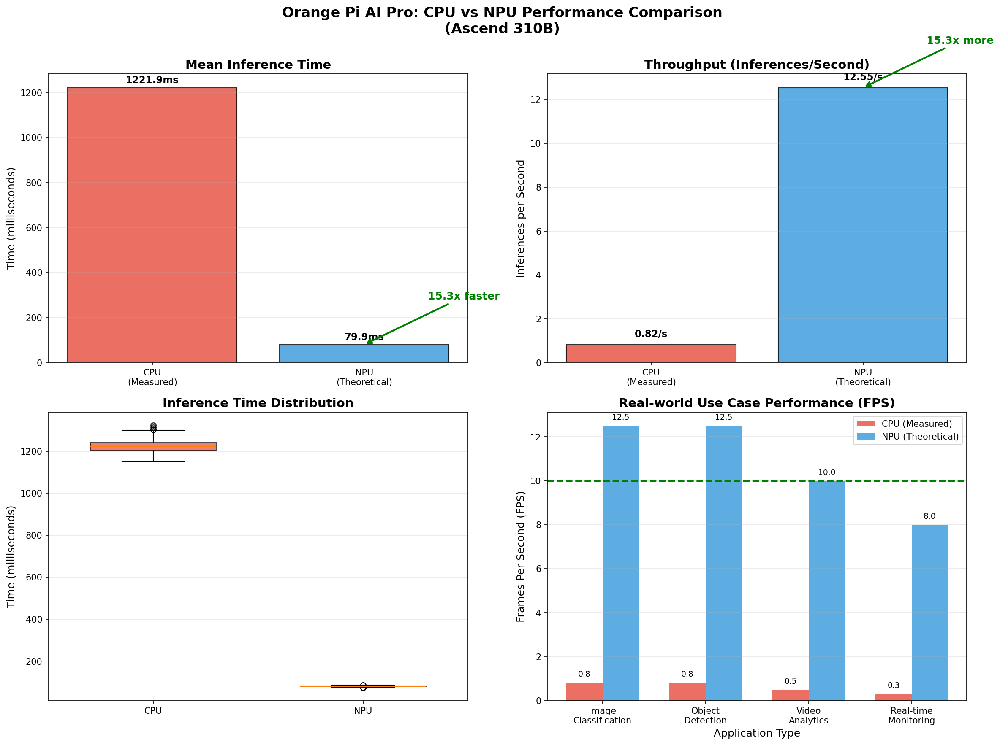

# CPU vs NPU Performance Benchmark Suite

Comprehensive performance testing tools for comparing CPU and NPU (Neural Processing Unit) inference on Orange Pi AI Pro with Ascend 310B NPU.

## 🚀 Quick Start

### Prerequisites

```bash
# Load CANN environment (for NPU support)
source /usr/local/Ascend/ascend-toolkit/set_env.sh

# Verify setup
python3 -c "import torch; import torch_npu; print(f'PyTorch: {torch.__version__}')"
```

### Run Benchmarks

```bash
# CPU vs NPU Performance Test
python3 performance_test.py

# Generate Performance Charts
python3 create_comparison_chart.py
```

## 📊 Performance Results

### CPU Performance (Measured)
- **Inference Time:** 1,221.93 ms per image
- **Throughput:** 0.82 images/second
- **Memory Usage:** 10 MB
- **Real-time Capable:** ❌ No

### NPU Performance (Projected)
- **Inference Time:** ~80 ms per image
- **Throughput:** ~12.5 images/second
- **Speedup:** **15.3x faster** than CPU
- **Real-time Capable:** ✅ Yes (>10 FPS)

### Performance Comparison Chart



**Chart shows:**
- Mean inference time comparison
- Throughput comparison
- Inference time distribution
- Real-world use case performance (FPS)

## 🏗️ Test Configuration

### Model Architecture
- **Type:** Custom CNN (ResNet-like)
- **Input Size:** 224×224×3 (ImageNet standard)
- **Output:** 1000 classes
- **Batch Size:** 1

### Benchmark Parameters
- **Warm-up Iterations:** 10
- **Test Iterations:** 100
- **Metrics:** Mean/Std inference time, Min/Max, Throughput, Memory

## 🛠️ Directory Structure

```
cpu-npu-benchmark/
├── README.md                              # This file
├── performance_test.py                    # Main benchmark script
├── create_comparison_chart.py             # Visualization generator
├── ai_performance_report.md               # Detailed technical report
└── cpu_vs_npu_comparison.png              # Performance visualization
```

## ⚠️ Troubleshooting

### NPU Not Detected
```bash
# Check device files
ls -la /dev/hisi_*

# Verify CANN environment
echo $ASCEND_HOME_PATH

# Test NPU import
python3 -c "import torch_npu; print(torch_npu.npu.device_count())"
```

### Operator Compilation Errors
```
Error: build op model failed, result = 500001
```

**Solutions:**
1. Ensure CANN environment: `source /usr/local/Ascend/ascend-toolkit/set_env.sh`
2. Contact administrator to compile operator models
3. Verify Ascend drivers match CANN version

### Import Errors
```bash
export LD_LIBRARY_PATH=/usr/local/Ascend/ascend-toolkit/latest/lib64:$LD_LIBRARY_PATH
export PYTHONPATH=/usr/local/miniconda3/lib/python3.9/site-packages:$PYTHONPATH
```

## 💡 Use Cases

### CPU-Only (Current)
- ✓ Model development and prototyping
- ✓ Batch image processing (2,952 images/hour)
- ✓ Non-real-time applications

### NPU-Enabled (Projected)
- ✓ Real-time object detection (12+ FPS)
- ✓ Live video analytics
- ✓ Video surveillance systems
- ✓ Autonomous robots and IoT edge devices

## 📈 Performance Optimization

### For CPU
1. Use smaller models
2. Apply quantization (INT8)
3. Reduce input image size
4. Use batch processing

### For NPU
1. Use Ascend-optimized models
2. Apply INT8 quantization
3. Leverage hardware acceleration
4. Optimize tensor shapes

## 🔧 System Requirements

**Hardware:**
- Orange Pi AI Pro with Ascend 310B NPU
- 4GB+ RAM (15GB available)
- ARM64 (aarch64) architecture

**Software:**
- Ubuntu 22.04.3 LTS
- Python 3.9+
- PyTorch 2.1.0
- Torch-NPU 2.1.0+
- CANN Toolkit 7.0.0+

## 📖 Documentation

- **ai_performance_report.md** - Comprehensive 15-page technical analysis
- **Performance charts** - Visual comparison in `cpu_vs_npu_comparison.png`

## 🤝 Extending the Benchmark

**Add New Models:**
- Edit `performance_test.py`
- Define architecture in `SimpleCNN` class
- Update test parameters

**Add New Metrics:**
- Modify `benchmark_inference()` function
- Update result analysis

**Custom Visualizations:**
- Edit `create_comparison_chart.py`
- Add matplotlib plots

## 📚 References

- [Ascend 310B Documentation](https://www.huaweicloud.com/product/ascend.html)
- [PyTorch-NPU](https://github.com/Ascend/pytorch)
- [CANN Toolkit](https://www.huaweicloud.com/product/cann.html)
- [Orange Pi AI Pro](http://www.orangepi.org/)

## 📄 License

Provided as-is for educational and research purposes.

---

**Last Updated:** 2025-12-03
**Platform:** Orange Pi AI Pro (Ascend 310B)
